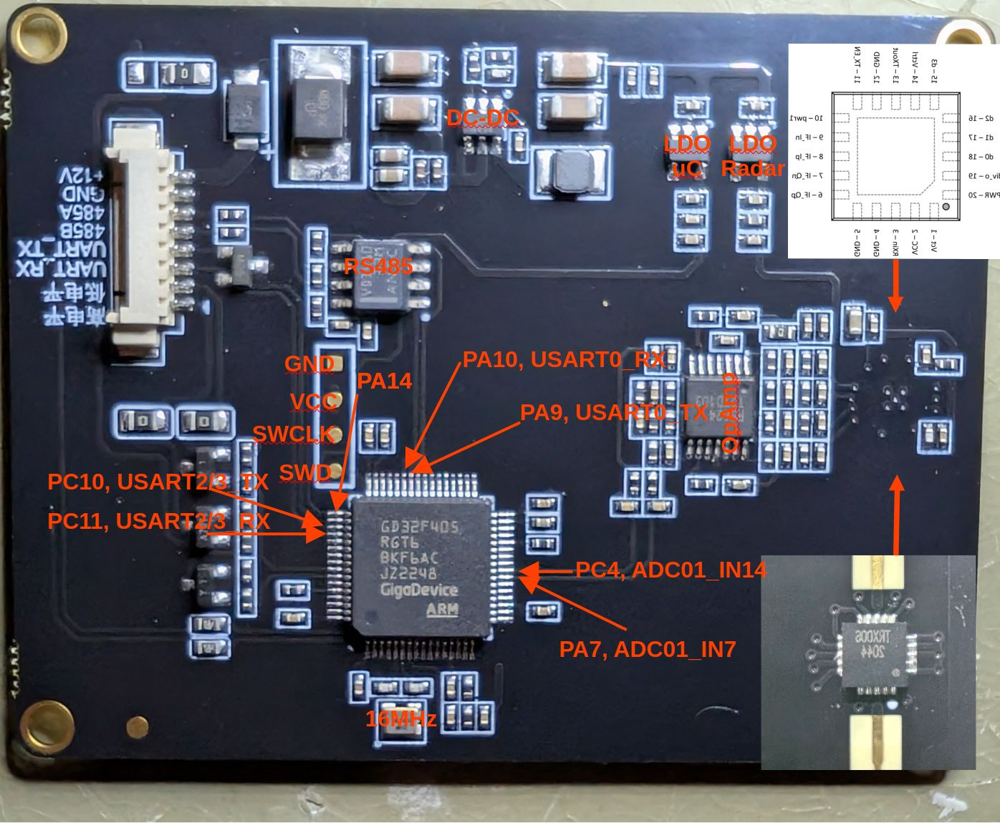

# Reverse Engineering the Hi-Link LD2415H Vehicle Speed Measurement Radar 



This is a CW radar with a high gain antenna.

I think this is a great hackable platform: 
 - By looking at the Radar IC this PCB maybe can be hacked to inject a voltage into the VCO to turn it into a FMCW radar
 - The amplification stage can be changed to spit out a I and Q signal (instead of being used for two gain stages)
 - The antenna has a pretty high gain and the chip is using full 20dBm

The downside is that it's not that cheap (30-40€).

## Hardware

The board consists of a 
- Microcontroller: GigaDevice GD32F405RGT6: CM4, 168MHz, 1MB Code Flash / 192kB RAM, 12-bit ADC up to 2.6MSPS
- Quartz: 16MHz
- RS-232<->RS-485 transceiver: TI (?) VD1410
- Quad-OpAmp: Runic RS624:
- Radar IC: Silicon Radar TRX006

And  smaller stuff like a DC-DC-Converter, Transistors or Mosfets. Not counting them here.

### Pin Configuration

#### ADC 

- PA7, ADC01_IN7, Turquoise: Low Gain
- PC4, ADC01_IN4, Yelllow: High Gain, 90° shifted


#### RS485

- PA10: USART0_RX
- PA9: USART0_TX

#### Serial

- PC10: USART2/3_RX
- PC11: USART2/3_TX

## Firmware

Connection with a J-Link was successful

```
 - Executing default behavior previously saved in the registry.
 - Device will be unsecured now.
 - Reset: Halt core after reset via DEMCR.VC_CORERESET.
 - Reset: Reset device via AIRCR.SYSRESETREQ.
 - InitTarget() end - Took 513ms
 - Found SW-DP with ID 0x2BA01477
 - DPIDR: 0x2BA01477
 - CoreSight SoC-400 or earlier
 - Scanning AP map to find all available APs
 - AP[1]: Stopped AP scan as end of AP map has been reached
 - AP[0]: AHB-AP (IDR: 0x24770011, ADDR: 0x00000000)
 - Iterating through AP map to find AHB-AP to use
 - AP[0]: Core found
 - AP[0]: AHB-AP ROM base: 0xE00FF000
 - CPUID register: 0x410FC241. Implementer code: 0x41 (ARM)
 - Found Cortex-M4 r0p1, Little endian.
 - FPUnit: 6 code (BP) slots and 2 literal slots
 - CoreSight components:
 - ROMTbl[0] @ E00FF000
 - [0][0]: E000E000 CID B105E00D PID 000BB00C SCS-M7
 - [0][1]: E0001000 CID B105E00D PID 003BB002 DWT
 - [0][2]: E0002000 CID B105E00D PID 002BB003 FPB
 - [0][3]: E0000000 CID B105E00D PID 003BB001 ITM
 - [0][4]: E0040000 CID B105900D PID 000BB9A1 TPIU
 - [0][5]: E0041000 CID 00000000 PID 00000000 ???
 - Executing init sequence ...
  - Initialized successfully
 - Target interface speed: 4000 kHz (Fixed)
 - Found 1 JTAG device. Core ID: 0x2BA01477 (None)
 - Connected successfull
```

I accidentally nuked the integrated firmware - so this ends here.
